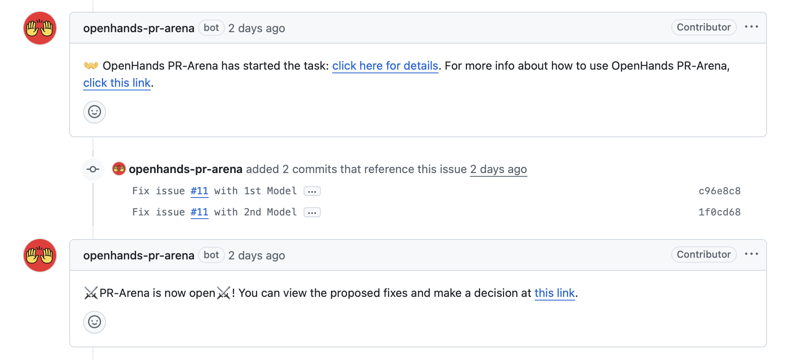
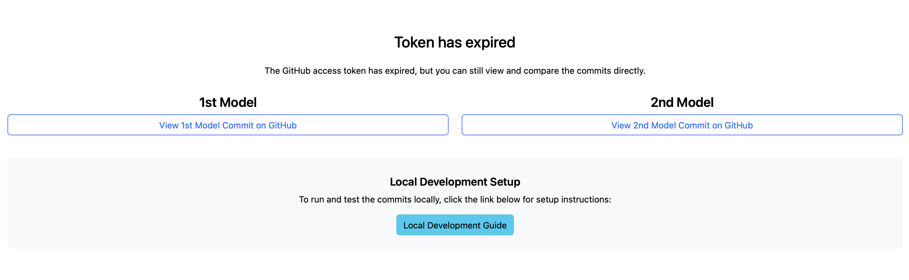

# OpenHands PR Arena - User Guide

This guide helps you navigate and test Arena results even after the Arena has expired.

## Viewing Arena Results After Expiration

Even if the Arena has closed or expired, you can still view the proposed fixes and vote on which model performed better.

### How to Access the Arena

1. **Find the Arena Link**: Look for the comment from `openhands-pr-arena` bot in your issue that says:
   ```
   PR-Arena is now open! You can view the proposed fixes and make a decision at this link.
   ```

2. **Click the Arena Link**: As shown in the image below, you can click on the provided link even after the Arena has expired:

   

3. **Navigate Through Commits**: You can navigate through each commit and vote only if you haven't voted yet.

   

## Testing Commits Locally

Want to test the proposed solutions on your local machine? Here's how to pull and run the commits locally:

### Step 1: Fetch the Commits

The Arena creates two commits for each model's solution. You can find the commit hashes in the issue comments or in the Arena interface.

Alternatively, you can:
```bash
# Fetch all branches and commits
git fetch origin

# View recent commits to find the Arena commits
git log --oneline -10
```

### Step 2: Test Each Solution

Clone the repository (if you haven't already):
```bash
git clone https://github.com/your-username/your-repo.git
cd your-repo
```

Fetch all updates just in case (this is often done automatically during clone):
```bash
git fetch origin
```

Checkout the specific commit by its hash:
```bash
git checkout COMMIT_HASH_MODEL_1
```
This moves your working directory to the state of that commit. You'll be in a detached HEAD state—meaning you're not on a branch.

Optional: Create a new branch if you'd like to make changes based on this commit:
```bash
git checkout -b test-model-1
```
That way, any new commits are tracked properly.

Run your tests or application:
```bash
npm install  # or your package manager
npm test     # run tests
npm start    # start the application
```

Switch to test the other model:
```bash
git checkout COMMIT_HASH_MODEL_2
# Optional: Create a branch
git checkout -b test-model-2

# Run the same tests
npm install
npm test
npm start
```

### Step 3: Clean Up

After testing, clean up your test branches:

```bash
# Switch back to main branch
git checkout main

# Delete test branches
git branch -D test-model-1 test-model-2
```

## Making Your Decision

After testing both solutions locally:

1. Return to the Arena link (it works even after expiration)
2. Review your local testing results
3. Vote for the model that provided the better overall solution

## Need Help?

If you encounter any issues:
- Open an issue on this repository
- Email us at [jiseungh@andrew.cmu.edu](mailto:jiseungh@andrew.cmu.edu)
- Check the main [README.md](README.md) for more information

---

**Pro Tip**: Testing locally gives you the most comprehensive understanding of which solution works best for your specific use case and development environment.