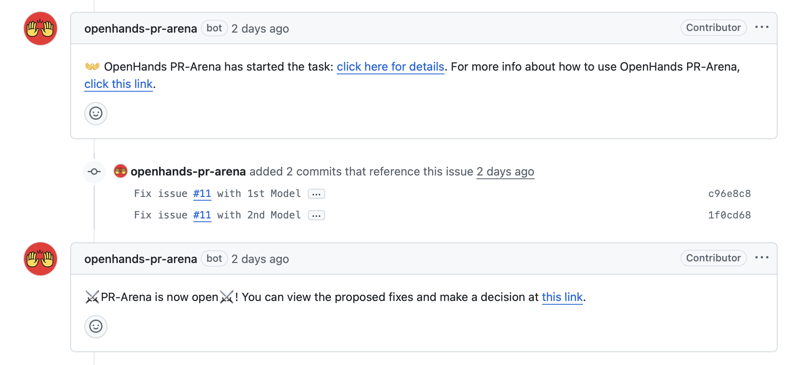

# OpenHands PR Arena - User Guide

This guide helps you navigate and test Arena results even after the Arena has expired.

## Viewing Arena Results After Expiration

Even if the Arena has closed or expired, you can still view the proposed fixes and vote on which model performed better.

### How to Access the Arena

1. **Find the Arena Link**: Look for the comment from `openhands-pr-arena` bot in your issue that says:
   ```
   PR-Arena is now open! You can view the proposed fixes and make a decision at this link.
   ```

2. **Click the Arena Link**: As shown in the image below, you can click on the provided link even after the Arena has expired:

   

3. **Navigate Through Commits**: Once in the Arena, you can:
   - View side-by-side comparisons of both model solutions
   - Navigate through each commit and see the changes made
   - Review the code differences between the two approaches
   - Vote for the model that provided the better solution

## Testing Commits Locally

Want to test the proposed solutions on your local machine? Here's how to pull and run the commits locally:

### Step 1: Fetch the Commits

The Arena creates two commits for each model's solution. You can find the commit hashes in the issue comments or in the Arena interface.

```bash
# Fetch all branches and commits
git fetch origin

# View recent commits to find the Arena commits
git log --oneline -10
```

### Step 2: Test Each Solution

For each commit you want to test:

```bash
# Create a new branch for testing (replace COMMIT_HASH with actual hash)
git checkout -b test-model-1 COMMIT_HASH_MODEL_1

# Run your tests or application
npm install  # or your package manager
npm test     # run tests
npm start    # start the application

# Switch to test the other model
git checkout -b test-model-2 COMMIT_HASH_MODEL_2

# Run the same tests
npm install
npm test
npm start
```

### Step 3: Compare Results

1. **Functionality Testing**: 
   - Does the fix actually resolve the original issue?
   - Are there any new bugs introduced?
   - How does the application behave with each solution?

2. **Code Quality**: 
   - Which solution is more maintainable?
   - Which follows better coding practices?
   - Which integrates better with the existing codebase?

3. **Performance**: 
   - Are there performance differences between the solutions?
   - Which solution is more efficient?

### Step 4: Clean Up

After testing, clean up your test branches:

```bash
# Switch back to main branch
git checkout main

# Delete test branches
git branch -D test-model-1 test-model-2
```

## Making Your Decision

After testing both solutions locally:

1. Return to the Arena link (it works even after expiration)
2. Review your local testing results
3. Consider both functionality and code quality
4. Vote for the model that provided the better overall solution
5. Your feedback helps improve the models for future issues!

## Need Help?

If you encounter any issues:
- Open an issue on this repository
- Email us at [jiseungh@andrew.cmu.edu](mailto:jiseungh@andrew.cmu.edu)
- Check the main [README.md](README.md) for more information

---

**Pro Tip**: Testing locally gives you the most comprehensive understanding of which solution works best for your specific use case and development environment.